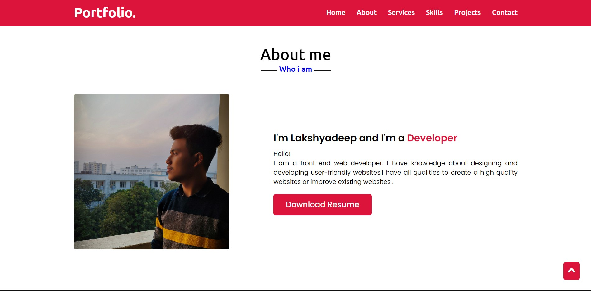

<h1><a href="https://lakshyadeepgogoi.netlify.app/project.html">My-Portfolio</a></h1>

<h3>Showcase My Portfolio 🛍️🎇</h3>

<figure>
  
   
  <figcaption>projects screenshot</figcaption>
</figure>

## Introducing Projects

Present all your projects in style with a super customizable web app! ✨

## Inspiration

Needed a way to display all my projects, used my [portfolio's project section](https://lakshyadeepgogoi.netlify.app/#home) as inspiration.

## Getting Projects

The site should be live on `https://<your-username>.github.io/projects` or `lakshyadeep.netlify.app`

## Viewing projects

Open `index.html` in your favorite browser or visit [lakshyadeep.netlify.app](https://lakshyadeepgogoi.netlify.app/#home).

## How it was built

Projects was built using `HTML` `CSS` & `JavaScript`.
It will be updated soon.
Later I use Tailwind CSS and Reactjs Framework

## What I learned

- Learned about Web-Development, especially implementation of `Knowldege`.
- Flex, box-shadow and some other CSS tricks were revisited.

## What's next

You tell me!

Hit the ⭐ button if you found this useful.

## More Info

<a href="https://github.com/lakshyadeepgogoi">Source</a> | <a href="lakshyadeepgogoi/LakshyadeepGogoi123.github.io">Website</a>

